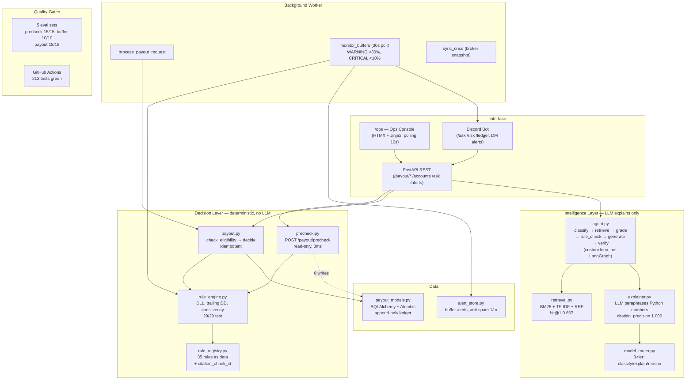
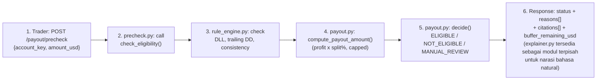
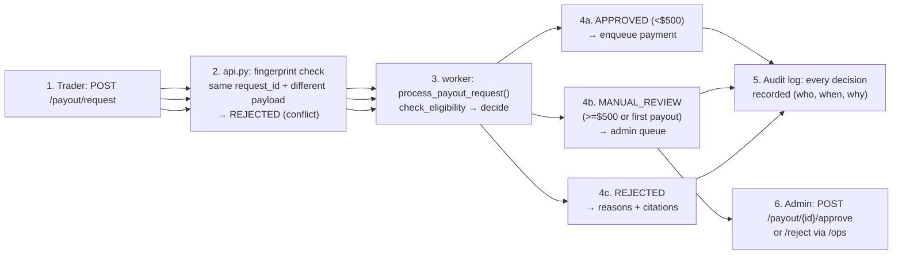
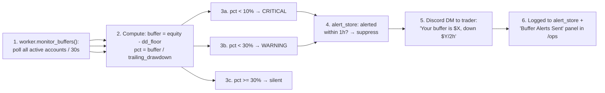
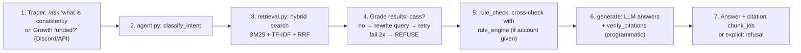
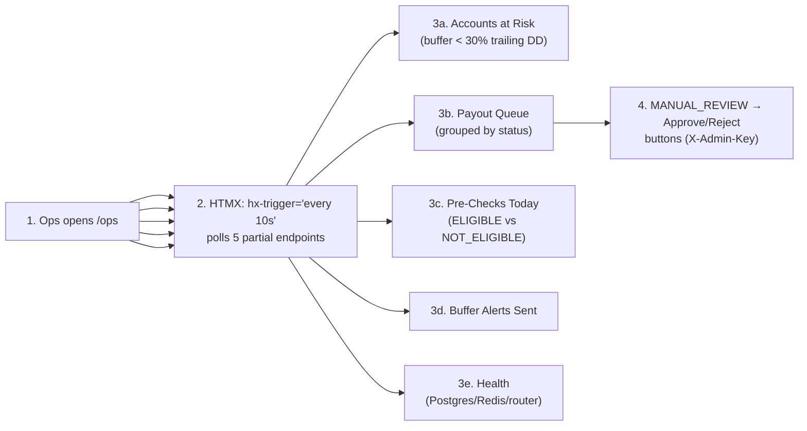

# Architecture

Tradeify Risk Copilot + Payout Risk Gate. One repo, one question answered:
"Can this trader payout today — and if not, why?"

## System Map

## Case Flows

### 1. Pre-check payout (read-only, 3ms)

### 2. Full payout request (idempotent)

### 3. Buffer monitor (30s worker poll)

### 4. Trader asks a rule question (agentic RAG)

### 5. Ops monitors risk (dashboard)

## Design Decisions

| Decision | Why | Rejected alternative |
|---|---|---|
| No LLM on money path | LLMs hallucinate numbers; a wrong payout amount is a lawsuit | "LLM decides everything" (junior approach) |
| Custom agent loop, not LangGraph | 6-node linear loop doesn't need graph orchestration; dependency-free = testable in CI without framework | LangGraph (heavier, same behavior for this shape) |
| Custom hybrid retrieval, not LangChain | BM25+TF-IDF+RRF benchmarked: hit@1 0.867 beats BM25-only and vector-only on our eval | LangChain defaults (JD explicitly warns against these) |
| HTMX not React | Internal tool: ship in hours, one developer, zero build step | Next.js (overkill for 5 panels) |
| Polling not WebSocket | 10s staleness is fine for ops; no connection state to manage | WebSocket (complexity without payoff here) |
| Append-only ledger | Money history must be immutable; corrections are new entries | UPDATE/DELETE on ledger (destroys audit trail) |
| Pre-check is read-only | A check must never mutate state; proven by test (0 writes) | Pre-check that creates a "pending" record (side effects) |

## Constraints Enforced in Code

1. `payout.py`, `retrieval.py`, `agent.py`, `rule_engine.py` are never modified
   by feature work — only called. Verified via `git diff` in CI reviews.
2. Every money decision carries `reasons[]` + `citations[]`. No uncited
   rejections (eval gate: 0 violations).
3. Idempotency on all transactional endpoints (same request_id = same result).
